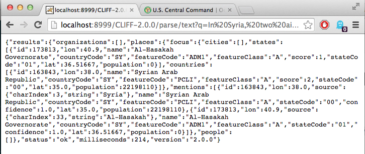

CLIFF up
=========

This repo contains everything you need to painlessly get MIT's CLIFF
text geolocation server up and running inside a virtual machine that you can access
from your host machine. CLIFF takes text as input and returns a structured list
of the places the text is about. It is built on Berico Technologies'
[CLAVIN](https://github.com/Berico-Technologies/CLAVIN) geotagging and
geoparsing software and Stanford's
[CoreNLP](http://nlp.stanford.edu/software/corenlp.shtml) natural language
parsing software.

[CLIFF](http://cliff.mediameter.org/), according to its
[Github](https://github.com/c4fcm/CLIFF) is a "lightweight server to allow HTTP
requests to the Stanford Named Entity Recognized and a modified CLAVIN 2.0.0
geoparser." Crucially, it makes an attempt to solve the "aboutness" problem
of establishing which of many place names in a piece of news text is the place
the story is actually about.

However, for someone who has no experience with Java or Tomcat servers, it's
hellishly difficult to get running from scratch. I've set it up inside an
Ubuntu virtual machine where I could minimize clutter and confusion, and
forwarded its port to my host machine so I could talk to it. This repo contains
instructions to set up an identical system on your computer.

Setup
--------

First, you need to have the ability to set up a virtual machine on your
computer. (A virtual machine is essentially a second, self-contained computer
running on yours). Vagrant is a piece of software that allows you to use a
configuration file to get your virtual machine configured the way that I have
mine set up. The advantage of this approach is that you can be guarenteed to
have the same system that I developed on, so my instructions should work
without a hitch. If you'd rather run it natively on your machine, I hope my
instructions will also give you a good place to start doing that.

1. Download and install [Vagrant](https://docs.vagrantup.com/v2/installation/).

2. Download and install [VirtualBox](https://www.virtualbox.org/wiki/Downloads).

3. Clone this repository (either from the command line with `git clone` or
   using the download zip button on the lower right side of this page. Make
   sure you unzip it if you take the second route). This repo contains the
   Vagrant setup file to get your machine looking like mine and with the port
   forwarded correctly, and `bootstrap.sh`, which will run a series of commands
   to download CLAVIN, CLIFF, Stanford CoreNLP, Java, Tomcat, and get
   everything setup in just the right way.

4. From the command line, navigate to the folder for the repository you
   downloaded. 
   
   > If you're unfamiliar with the command line, don't worry, this
   > is easy. In a Mac, highlight the folder in finder and go to File > Get Info.
   > Copy the path it has after "Where" (something like "/Users/.../CLIFF-up").
   > Open the Terminal, type `cd ` and paste that path. You'll now be inside your
   > folder.

5.  Type `vagrant up` and go make some coffee, because this will take a while,
     as in potentially a couple of hours to download everything and compile the
     index for the geographic placenames. (It builds a Lucene index of all ~10
     million place names to give awesome millisecond search abilities, but that
     takes a while). There might be a few warnings, but that's normal. There
     might be some errors, including a "Build Failure" warning when compiling
     CLIFF, but don't worry about those unless the whole thing fails out or you
     can't get anything out of it when it's all done.

6. When it's done provisioning the machine (seriously, make two cups), go to
   <http://localhost:8999/CLIFF-2.0.0/parse/text?q=In%20Syria,%20two%20airstrikes%20west%20of%20Al-Hasakah%20successfully%20struck%20multiple%20ISIL%20buildings,%20including%20an%20air%20observation%20building%20and%20staging%20areas.>
   and see if it spits out some JSON.  To do your own sentences, delete
   everything after "?q=" and put in your own text. It could take a couple of
   minutes to get the server completely up and running after it's deployed.

   If you don't get anything from the web page, or the last line of the
   provisioning script returns `/tmp/vagrant-shell: 102: /tmp/vagrant-shell:
   /bin/startup.sh: not found`, the Tomcat server may not have started. From
   the folder where you built the VM, log into the VM by typing `vagrant ssh`,
   then, from inside the VM, run `sudo $CATALINA_HOME/bin/startup.sh`. That
   should get it going.

Maintenance 
-------- 

The virtual machine is pretty heavy duty (I gave it 4 gigs
of RAM), so you might not want to keep it running all the time. To shut it
down, navigate to the folder you started it from, and run (from the terminal)
`vagrant halt`. To start it up again run `vagrant up`. This time it should only
take about a minute to get up and running since it saves all the setup from the
first time. When you start it up, you'll need to log into the VM to get the
server up and running. Type `vagrant ssh` and you'll log into the VM. Paste
this to get the Tomcat server running: `sudo
/home/vagrant/apache-tomcat-7.0.57/bin/startup.sh`. You can logout or close the
window without killing the virtual machine.

